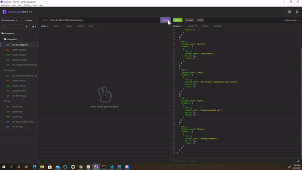

# E-Commerce-Back-End
    

  
## Description
  Using Insomnia, you can follow the CRUD operations to manipulate data for your stores inventory.
  
## Table of Contents
  - [Usage](#Usage)
  - [Installation](#Installation)
  - [Usage](#Usage)
  - [Contributing](#Contributing)
  - [Commands](#Commands)
  - [Tutorials](#Tutorials)
  - [Screenshots](#Screenshots)
  - [Credits](#Credits)
  - [License](#License)
  - [Questions](#Questions)
  
## Usage
  You will use this application in Insomnia to add and remove categories and inventory items with in the categories. 
  
## Installation
  NPM Install.  Make sure you have dotenv, express, mysql2, and sequelize.
  
## Contributing 
  You may contact me with suggestions on additions to the project.
  
## Commands
  Mysql, source schema.qgl, nmp run seed, npm start.

## Tutorials
[Video Walkthrough](https://drive.google.com/file/d/18d4KnpNmZfb2TBsv2Nzsz4gjXNL7kePT/view?usp=sharing)

## Screenshots

## Credits
  Ashby Blakely 
  
  ## License 
  [Link to the MIT license used](https://opensource.org/licenses/MIT)  
  
 
## Questions
  [Link to GitHub Profile](https://github.com/AshbyLB) 
  Feel free to email me at Ashbyleeblakely@gmail.com if you have any questions.
